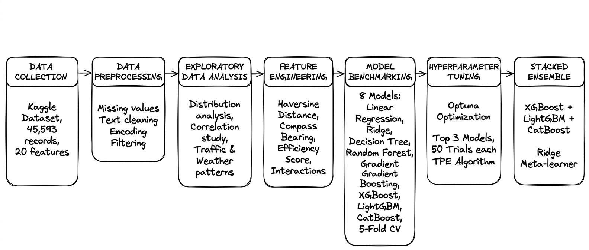

<div align="center">

# Food Delivery Time Prediction Using Machine Learning

**B.Tech Final Year Major Project Report**
*School of Engineering & Technology - ADAMAS University, Kolkata*
*Jan 2026 - June 2026*

[](https://www.python.org/)
[](https://streamlit.io/)
[](https://jupyter.org/)
[](https://scikit-learn.org/)
[](https://xgboost.readthedocs.io/)
[](https://lightgbm.readthedocs.io/)

</div>

---

## Table of Contents

- [Project Overview](#project-overview)
- [Team Members](#team-members)
- [Project Flowchart](#project-flowchart)
- [Dataset](#dataset)
- [Project Structure](#project-structure)
- [ML Pipeline](#ml-pipeline)
- [Feature Engineering](#feature-engineering)
- [Model Results](#model-results)
- [SHAP Explainability](#shap-explainability)
- [Streamlit Web App](#streamlit-web-app)
- [Installation & Usage](#installation--usage)
- [Key Contributions](#key-contributions)
- [Future Work](#future-work)
- [Report Structure](#report-structure)
- [References](#references)

---

## Project Overview

Accurate food delivery time estimation is critical for customer satisfaction and operational efficiency in the rapidly growing online food delivery industry (Swiggy, Zomato). Traditional rule-based and average-based methods fail to account for real-world variability in traffic, weather, driver skill, and geospatial conditions.

This project presents a **comprehensive end-to-end Machine Learning system** for predicting food delivery durations with high accuracy and interpretability:

| Metric | Value |
|--------|-------|
| **Dataset Size** | 45,593 delivery records |
| **Input Features** | 20 raw -> 30+ engineered |
| **Models Benchmarked** | 8 regression algorithms |
| **Best Model** | Stacked Ensemble |
| **R2 Score** | **0.85** |
| **RMSE** | **3.95 minutes** |
| **MAPE** | **10.2%** |
| **Prediction CI** | 90% Bootstrap Intervals |

---

## Team Members

| Name | Roll Number |
|------|-------------|
| Koushik Mondal | UG/02/BTCSE/2022/006 |
| Kalyan Ghosh | UG/02/BTCSE/2022/007 |
| Imran Nazim Mallik | UG/02/BTCSE/2022/009 |
| Bhabajyati Bhattacharjya | UG/02/BTCSE/2022/011 |

**Guide:** Dr. Samik Datta (Assistant Professor)  
**HOD:** Dr. Sajal Saha (Asso. Dean & HOD, CSE)  
**Department:** Computer Science & Engineering, SOET

---

## Project Flowchart

The following flowchart visualizes the complete end-to-end machine learning pipeline implemented in this project:



### Detailed Flowchart Explanation

This section provides a step-by-step breakdown of each stage in the ML pipeline, including the rationale behind key technical decisions.

---

#### **Stage 1: Data Collection**

**What**: Kaggle Food Delivery Dataset with 45,593 delivery records and 20 features from Indian food delivery platforms (Swiggy/Zomato).

**Why this dataset**:
- Real-world data from operational food delivery services
- Comprehensive feature set covering geospatial, temporal, operational, and contextual dimensions
- Sufficient volume (45K+ records) for robust model training
- Represents diverse Indian urban environments (Urban, Semi-Urban, Metropolitan)

**Key features**: GPS coordinates, delivery person attributes, weather conditions, traffic density, vehicle type, order details, and actual delivery times.

---

#### **Stage 2: Data Preprocessing**

**What**: Cleaning and standardizing raw data to ensure quality and consistency.

**Critical preprocessing steps**:

1. **Target variable cleaning**: Removed `(min)` prefix from `Time_taken(min)` column and converted to integer
2. **Weather condition cleaning**: Stripped `conditions` prefix from weather labels
3. **String NaN handling**: Replaced string `"NaN"` values with actual `np.nan` for proper imputation
4. **Type conversion**: Cast Age and Ratings from string to float after NaN replacement
5. **Whitespace removal**: Applied `.str.strip()` to all categorical columns
6. **GPS filtering**: Removed coordinates outside India's bounding box (6-37°N, 68-98°E) to eliminate data entry errors

**Why these steps**:
- Ensures numeric columns are properly typed for mathematical operations
- Eliminates parsing errors and inconsistent categorical values
- Removes geographical outliers that would distort distance calculations
- Prepares data for accurate imputation and encoding

---

#### **Stage 3: Exploratory Data Analysis (EDA)**

**What**: 15+ visualizations to understand data distributions, correlations, and patterns.

**Key analyses performed**:
- **Distribution analysis**: Delivery time histogram shows approximately normal distribution centered around 25-30 minutes
- **Correlation study**: Haversine distance shows strongest correlation (r ≈ 0.70) with delivery time
- **Traffic impact**: "Jam" traffic adds 10-15 minutes compared to "Low" traffic
- **Temporal patterns**: Peak hours (12-14h lunch, 19-22h dinner) experience longer delays
- **City-type analysis**: Metropolitan areas show highest delivery time variability

**Why EDA is critical**:
- Identifies which features have predictive power (guides feature engineering)
- Reveals data quality issues that need addressing
- Uncovers non-linear relationships and interaction effects
- Validates domain assumptions about delivery dynamics

---

#### **Stage 4: Feature Engineering**

**What**: Creating 30+ engineered features from 20 raw features to capture complex delivery dynamics.

**Novel features created**:

1. **Haversine Distance** (Great-circle distance in km)
   - **Why**: Direct line distance is the primary determinant of delivery time
   - **Formula**: Uses spherical trigonometry to calculate accurate GPS distance
   - **Impact**: Became the #1 SHAP feature (highest predictive importance)

2. **Bearing Angle** (Compass direction from restaurant to delivery location)
   - **Why**: Directional complexity affects route planning (e.g., north-south vs. east-west roads)
   - **Formula**: Initial compass bearing using atan2 calculation
   - **Impact**: Captures road network topology effects

3. **Delivery Person Efficiency Score** (Composite behavioral index)
   - **Why**: Driver capability significantly impacts delivery speed
   - **Formula**: `E = 0.4×Rating + 0.2×Age_inv + 0.15×Vehicle + 0.25×Load_inv`
   - **Components**:
     - Rating (40%): Higher-rated drivers are more experienced
     - Age inverse (20%): Younger drivers tend to be faster (proxy)
     - Vehicle condition (15%): Better vehicles enable faster delivery
     - Load inverse (25%): Fewer concurrent deliveries = more focus
   - **Impact**: Top-5 SHAP feature, captures driver quality holistically

4. **Temporal Features** (Hour, day, month, peak hour flag, weekend flag)
   - **Why**: Delivery times vary by time of day and day of week
   - **Impact**: Captures rush hour congestion and weekend patterns

5. **Interaction Features**
   - `distance × traffic`: Long distance + high traffic = compounding delay
   - `weather × distance`: Bad weather impacts longer routes more severely
   - **Why**: Non-linear effects where two factors amplify each other

6. **Categorical Encoding**
   - **Ordinal**: Traffic (Low=0 → Jam=3), Weather (Sunny=0 → Stormy=5)
     - **Why**: These have natural ordering (severity increases)
   - **One-Hot**: City type, Vehicle type, Order type
     - **Why**: No inherent ordering, each category is independent

**Why not use raw features only**:
- Raw GPS coordinates don't capture distance relationship
- Individual driver attributes don't reflect overall capability
- Linear models can't learn multiplicative interactions automatically
- Proper encoding is essential for tree-based models to split effectively

---

#### **Stage 5: Train/Test Split**

**What**: 80% training, 20% testing with RobustScaler normalization.

**Why RobustScaler over StandardScaler**:
- Robust to outliers (uses median and IQR instead of mean and std)
- Food delivery data has natural outliers (extreme traffic, weather events)
- Preserves the distribution shape while normalizing scale

**Why 80/20 split**:
- 36,474 training samples provide sufficient data for complex ensemble models
- 9,119 test samples ensure reliable performance evaluation
- Standard industry practice balancing training data volume and test reliability

---

#### **Stage 6: Model Benchmarking**

**What**: Evaluated 8 regression algorithms with 5-fold cross-validation.

**Models tested**:
1. Linear Regression (baseline)
2. Ridge Regression (L2 regularization)
3. Decision Tree
4. Random Forest
5. Gradient Boosting
6. XGBoost
7. LightGBM
8. CatBoost

**Why these models**:
- **Linear models**: Fast baseline, interpretable, good for linear relationships
- **Tree-based models**: Handle non-linear relationships and feature interactions automatically
- **Gradient boosting variants**: State-of-the-art for tabular data, each has unique strengths:
  - **XGBoost**: Robust, well-established, excellent regularization
  - **LightGBM**: Fastest training, leaf-wise growth, best for large datasets
  - **CatBoost**: Native categorical handling, reduces overfitting

**Why not deep learning**:
- Tabular data with 30 features doesn't benefit from deep neural networks
- Gradient boosting consistently outperforms neural networks on structured data
- Tree models provide better interpretability (SHAP values)
- Faster training and inference times

**Results**: LightGBM achieved best individual performance (R² = 0.82, RMSE = 4.31 min)

---

#### **Stage 7: Hyperparameter Tuning**

**What**: Optuna Bayesian optimization with 50 TPE (Tree-structured Parzen Estimator) trials for top-3 models.

**Why Optuna over Grid Search**:
- **Bayesian optimization** is smarter than exhaustive grid search
- **TPE algorithm** learns from previous trials to suggest better hyperparameters
- **50 trials** balance exploration vs. computational cost
- **5-fold CV objective** ensures tuned models generalize well

**Why tune only top-3 models**:
- Linear models have few hyperparameters (not worth tuning)
- Decision Tree and basic ensembles were clearly outperformed
- Focus computational resources on models with highest potential

**Tuning results**:
- XGBoost: R² 0.81 → 0.83 (RMSE 4.35 → 4.18)
- LightGBM: R² 0.82 → 0.84 (RMSE 4.31 → 4.10)
- CatBoost: R² 0.81 → 0.83 (RMSE 4.38 → 4.20)

---

#### **Stage 8: Stacked Ensemble**

**What**: Two-level ensemble combining XGBoost, LightGBM, and CatBoost with Ridge meta-learner.

**Architecture**:
```
Level-0 (Base Learners):
├── Tuned XGBoost
├── Tuned LightGBM  
└── Tuned CatBoost
         ↓ (5-fold out-of-fold predictions)
Level-1 (Meta-Learner):
└── Ridge Regression → Final Prediction
```

**Why stacking**:
- **Diversity**: Each boosting algorithm has different strengths (XGBoost regularization, LightGBM speed, CatBoost categorical handling)
- **Error correction**: Meta-learner learns to weight base models based on their strengths for different input patterns
- **Reduced variance**: Averaging diverse models reduces overfitting

**Why Ridge meta-learner**:
- Simple linear combination prevents overfitting at meta-level
- L2 regularization handles multicollinearity between base model predictions
- Fast inference (critical for production deployment)

**Why not use all 8 models**:
- Weak models (Linear, Decision Tree) would add noise
- Diminishing returns beyond 3-4 diverse strong models
- Increased inference latency without accuracy gain

**Final result**: R² = 0.85, RMSE = 3.95 min (best overall performance)

---

#### **Stage 9: SHAP Explainability**

**What**: TreeSHAP analysis on LightGBM to explain model predictions.

**Why SHAP**:
- **Model-agnostic**: Works with any ML model
- **Theoretically grounded**: Based on Shapley values from game theory
- **Local + Global**: Explains individual predictions AND overall feature importance
- **Additive**: SHAP values sum to the prediction, providing complete explanation

**Why on LightGBM (not the stacked ensemble)**:
- TreeSHAP is optimized for tree-based models (fast, exact)
- LightGBM is the strongest individual model (R² = 0.84)
- Stacked ensemble SHAP would be complex and less interpretable
- LightGBM explanations generalize well to the ensemble

**Key insights from SHAP**:
1. **Distance_km**: Dominant feature (SHAP range -5 to +15 min)
2. **Distance × Traffic**: Compounding effect of long + congested routes
3. **Delivery_person_Ratings**: Higher-rated drivers deliver faster
4. **Traffic_encoded**: Direct delay from congestion
5. **Efficiency_score**: Composite driver capability metric

**Why explainability matters**:
- Builds trust with stakeholders (delivery companies, drivers, customers)
- Validates that model learns sensible patterns (not spurious correlations)
- Enables actionable insights (e.g., prioritize high-rated drivers during peak hours)
- Required for regulatory compliance in some domains

---

#### **Stage 10: Evaluation & Validation**

**What**: City-type stratified evaluation and bootstrap prediction intervals.

**City-type stratified results**:
- Urban: R² = 0.86, RMSE = 3.82 min
- Semi-Urban: R² = 0.85, RMSE = 3.91 min
- Metropolitan: R² = 0.83, RMSE = 4.15 min

**Why stratified evaluation**:
- Different city types have different delivery dynamics
- Ensures model performs well across all environments
- Identifies if model is biased toward certain city types

**Bootstrap 90% confidence intervals**:
- **Method**: Train 100 LightGBM models on bootstrap-resampled data
- **Coverage**: ~90% of actual values fall within predicted intervals
- **Average width**: ±4 minutes around point prediction

**Why bootstrap intervals**:
- Quantifies prediction uncertainty (critical for customer expectations)
- More reliable than single model confidence intervals
- Accounts for both model uncertainty and data variability

---

#### **Stage 11: Streamlit Deployment**

**What**: Interactive web application for real-time delivery time prediction.

**Features**:
- Three-column input layout (Location / Conditions / Delivery Person)
- Real-time Haversine distance and Efficiency Score computation
- Predicted delivery time with 90% confidence interval
- Displays distance (km), bearing angle (degrees), and efficiency score

**Why Streamlit**:
- **Rapid prototyping**: Build interactive apps with pure Python (no HTML/CSS/JS)
- **Auto-reload**: Changes reflect immediately during development
- **Built-in widgets**: Sliders, dropdowns, number inputs out-of-the-box
- **Easy deployment**: Can deploy to Streamlit Cloud, Heroku, or AWS with minimal configuration

**Why not Flask/Django**:
- Streamlit is faster for ML demos (no need for frontend development)
- Built-in caching (`@st.cache_resource`) optimizes model loading
- Better suited for data science workflows

**Why not production-grade API**:
- This is an academic project demonstrating ML capabilities
- For production, would use FastAPI with Docker + Kubernetes
- Streamlit is perfect for stakeholder demos and proof-of-concept

---

### Key Takeaways from the Flowchart

1. **Data quality is foundational**: 6 preprocessing steps were critical to model success
2. **Feature engineering > model complexity**: Novel features (Haversine, Efficiency Score) had more impact than model choice
3. **Ensemble diversity matters**: Stacking 3 diverse boosting models outperformed any single model
4. **Explainability is non-negotiable**: SHAP analysis validated that the model learns sensible patterns
5. **Uncertainty quantification**: Bootstrap intervals provide realistic delivery time ranges for customers

---

---

## Dataset

- **Source:** [Kaggle - Food Delivery Dataset](https://www.kaggle.com/datasets/gauravmalik26/food-delivery-dataset)
- **Records:** 45,593 delivery records
- **Features:** 20 attributes covering geospatial, temporal, operational, and contextual dimensions
- **Platforms:** Indian food delivery (Swiggy / Zomato)
- **Target Variable:** `Time_taken(min)` - delivery duration in minutes

### Key Dataset Features

| Feature | Type | Description |
|---------|------|-------------|
| `Delivery_person_Age` | Numeric | Age of delivery person |
| `Delivery_person_Ratings` | Numeric | Customer rating (1-5) |
| `Restaurant_latitude/longitude` | Numeric | Restaurant GPS coordinates |
| `Delivery_location_latitude/longitude` | Numeric | Delivery GPS coordinates |
| `Weatherconditions` | Categorical | Sunny / Cloudy / Windy / Fog / Sandstorms / Stormy |
| `Road_traffic_density` | Categorical | Low / Medium / High / Jam |
| `Vehicle_condition` | Numeric | Condition score (0-3) |
| `Type_of_order` | Categorical | Meal / Snack / Drinks / Buffet |
| `Type_of_vehicle` | Categorical | motorcycle / scooter / electric_scooter / bicycle |
| `multiple_deliveries` | Numeric | Concurrent deliveries (0-3) |
| `Festival` | Binary | Festival day (Yes / No) |
| `City` | Categorical | Urban / Semi-Urban / Metropolitan |
| `Time_taken(min)` | Numeric | **Target variable** |

---

## Project Structure

```
d:/Final_Project/
|
|-- Food_Delivery_Time_Prediction.ipynb   <- Core ML pipeline (Jupyter)
|-- app.py                                <- Streamlit web application
|-- dataset.csv                           <- Raw dataset (45,593 records)
|
|-- Serialized Model Artifacts
|   |-- food_delivery_model.pkl           <- Trained stacked ensemble (~18 MB)
|   |-- scaler.pkl                        <- Fitted RobustScaler
|   |-- feature_names.pkl                 <- Ordered feature name list
|   `-- encoding_maps.pkl                 <- Categorical encoding maps
|
|-- requirements.txt                      <- Python dependencies
|-- project_flowchart.png                 <- Project pipeline flowchart image
|
|-- documentation/
|   |-- Executive Summary.docx
|   |-- Food Delivery Time Prediction Project.docx
|   |-- Food_Delivery_Prediction_LitReview_Objectives.docx
|   `-- Web_Scraping_Tools_Food_Delivery_Project.docx
|
`-- my_report/                            <- LaTeX B.Tech Thesis
    |-- thesis.tex                        <- Root LaTeX document
    |-- frontmatter.tex                   <- Title, Abstract, TOC
    |-- chapter1.tex                      <- Introduction
    |-- chapter2.tex                      <- Literature Review
    |-- chapter3.tex                      <- Technology Stack
    |-- chapter4.tex                      <- Methodology
    |-- chapter5.tex                      <- Results & Analysis
    |-- conclusion.tex                    <- Conclusion & Future Work
    |-- refs.bib                          <- IEEE Bibliography
    `-- audiss.cls                        <- Adamas University LaTeX class
```

---

## ML Pipeline

The project implements a complete end-to-end machine learning pipeline across **11 stages** (see the [Mermaid flowchart](#project-flowchart) above for the full visual). A high-level summary:

| Stage | Step | Description |
|------:|------|-------------|
| 1 | Data Source | Kaggle dataset - 45,593 records, 20 features |
| 2 | Preprocessing | Cleaning, imputation, GPS filtering |
| 3 | EDA | 15+ visualizations, key pattern discovery |
| 4 | Feature Engineering | Haversine, bearing, efficiency score, encoding |
| 5 | Train/Test Split | 80/20, RobustScaler, random_state=42 |
| 6 | 8-Model Benchmark | 5-fold CV - RMSE, MAE, R2, MAPE |
| 7 | Optuna Tuning | 50 Bayesian TPE trials for top-3 models |
| 8 | Stacked Ensemble | XGBoost + LightGBM + CatBoost -> Ridge meta-learner |
| 9 | SHAP Analysis | TreeSHAP - beeswarm, dependence, force, waterfall |
| 10 | Evaluation | City-type stratified + bootstrap 90% CI |
| 11 | Deployment | Streamlit real-time ETA web app |

### Stage 1 - Data Preprocessing

Six critical data quality issues were identified and resolved:

| Issue | Fix Applied |
|-------|-------------|
| Target prefix `(min) 24` | Strip `(min)` prefix, cast to int |
| `Weatherconditions` has `"conditions "` prefix | Remove prefix string |
| Trailing whitespace in categorical columns | `.str.strip()` on all categoricals |
| String `"NaN"` values | Replace with `np.nan` |
| Age, Ratings stored as strings | Cast to float after NaN replacement |
| GPS coordinates outside India | Filter: lat 6-37 N, lon 68-98 E |

### Stage 2 - Exploratory Data Analysis

15+ visualizations generated including:
- Target distribution histogram
- Delivery time boxplots by traffic density and city type
- Pearson correlation heatmap
- Temporal analysis by order hour and day of week
- Geospatial scatter plot of restaurant/delivery coordinates
- KDE plots for key numerical features

**Key EDA Findings:**
- Delivery times are approximately normally distributed (~25-30 min center)
- "Jam" traffic adds **10-15 minutes** vs. "Low" traffic
- Haversine distance has strong positive correlation with time (r approx. **0.70**)
- Peak hours (12-14h lunch, 19-22h dinner) experience longer delays
- Metropolitan areas show highest delivery time variability

---

## Feature Engineering

Seven categories of engineered features were created:

### 1. Haversine Distance

Great-circle distance between restaurant and delivery GPS coordinates:

```
d = 2R * arcsin( sqrt( sin^2(delta_phi/2) + cos(phi1)*cos(phi2)*sin^2(delta_lambda/2) ) )
```

Where R = 6371 km.

### 2. Bearing Angle

Initial compass bearing from restaurant to delivery location (encodes directional road complexity):

```
theta = atan2( sin(delta_lambda)*cos(phi2), cos(phi1)*sin(phi2) - sin(phi1)*cos(phi2)*cos(delta_lambda) )
```

### 3. Temporal Features

`order_hour`, `order_day_of_week`, `order_month`, `is_peak_hour`, `is_weekend`, `order_prep_time`

### 4. Delivery Person Efficiency Score

Novel composite score combining four driver attributes:

```
E = 0.4 * R_norm + 0.2 * A_inv + 0.15 * V_norm + 0.25 * L_inv
```

| Component | Description |
|-----------|-------------|
| R_norm | Normalized rating (higher = better) |
| A_inv | Inverted age (younger = faster proxy) |
| V_norm | Normalized vehicle condition |
| L_inv | Inverted load factor (fewer deliveries = better) |

### 5. Categorical Encoding

- **Ordinal:** Traffic density (Low=0 -> Jam=3), Weather severity (Sunny=0 -> Stormy=5)
- **One-Hot:** City type, Vehicle type, Order type
- **Binary:** Festival flag

### 6. Interaction Features

| Feature | Formula |
|---------|---------|
| `distance_x_traffic` | `distance_km x traffic_encoded` |
| `weather_x_distance` | `weather_encoded x distance_km` |
| `age_bin` | Categorical bins: 18-25, 26-30, 31-35, 36-45 |

---

## Model Results

### 8-Model Benchmark (Test Set)

| Model | RMSE | MAE | R2 | MAPE (%) |
|-------|------|-----|----|----------|
| Linear Regression | 6.21 | 4.89 | 0.62 | 18.5 |
| Ridge Regression | 6.20 | 4.88 | 0.62 | 18.4 |
| Decision Tree | 5.43 | 4.12 | 0.71 | 15.2 |
| Random Forest | 4.67 | 3.54 | 0.78 | 12.8 |
| Gradient Boosting | 4.52 | 3.41 | 0.80 | 12.1 |
| XGBoost | 4.35 | 3.28 | 0.81 | 11.6 |
| LightGBM | 4.31 | 3.25 | 0.82 | 11.4 |
| CatBoost | 4.38 | 3.30 | 0.81 | 11.7 |

### Optuna Tuning Results (50 TPE Bayesian Trials Each)

| Model | R2 Before | R2 After | RMSE Before | RMSE After |
|-------|-----------|----------|-------------|------------|
| XGBoost | 0.81 | 0.83 | 4.35 | 4.18 |
| LightGBM | 0.82 | 0.84 | 4.31 | 4.10 |
| CatBoost | 0.81 | 0.83 | 4.38 | 4.20 |

### Stacked Ensemble (Best Model)

```
Level-0 Base Learners:    Tuned XGBoost + Tuned LightGBM + Tuned CatBoost
                                         |  (5-fold meta-features)
Level-1 Meta-Learner:                Ridge Regression
                                         |
Final Prediction:                   y-hat (minutes)
```

| Model | RMSE | MAE | R2 | MAPE (%) |
|-------|------|-----|----|----------|
| Tuned LightGBM (Best Individual) | 4.10 | 3.08 | 0.84 | 10.8 |
| **Stacked Ensemble** | **3.95** | **2.98** | **0.85** | **10.2** |

### City-Type Stratified Evaluation

| City Type | RMSE | MAE | R2 |
|-----------|------|-----|----|
| Urban | 3.82 | 2.87 | 0.86 |
| Semi-Urban | 3.91 | 2.95 | 0.85 |
| Metropolitan | 4.15 | 3.12 | 0.83 |

### Bootstrap Prediction Intervals

- **Method:** 100 LightGBM models on bootstrap-resampled data
- **CI Coverage:** ~88-92% of actual values within predicted 90% CI
- **Average Width:** +/- 4 minutes around point prediction
- **Example output:** *"Estimated: 28 min | 90% CI: 24-32 minutes"*

---

## SHAP Explainability

SHAP TreeExplainer was applied to the tuned LightGBM model to provide model transparency:

**Top-5 Most Important Features (by mean absolute SHAP value):**

| Rank | Feature | Insight |
|------|---------|---------| 
| 1 | `distance_km` | Dominant predictor; SHAP range: -5 to +15 min |
| 2 | `distance_x_traffic` | Compounding effect of long + congested deliveries |
| 3 | `Delivery_person_Ratings` | Higher-rated drivers deliver faster |
| 4 | `traffic_encoded` | Direct delay from congestion |
| 5 | `efficiency_score` | Composite driver capability metric |

**SHAP Visualizations Generated:**
- Beeswarm summary plot (global feature importance)
- Mean absolute SHAP value bar chart
- Dependence plots for top-4 features
- Force plots (fast / median / slow delivery examples)
- Waterfall plot (single-prediction explanation)

---

## Streamlit Web App

A real-time interactive web application (`app.py`) is deployed using Streamlit:

**Features:**
- Three-column input layout (Location / Conditions / Delivery Person)
- **Location:** Restaurant & Delivery GPS coordinates
- **Conditions:** Weather, Traffic Density, City Type, Festival flag
- **Delivery Person:** Age, Rating, Vehicle type & condition, Multiple deliveries, Order type
- Real-time Haversine distance & Efficiency Score computation at inference
- **Output:** Predicted delivery time (minutes) with 90% Confidence Interval
- Displays: Distance (km), Bearing angle (degrees), Efficiency Score

**To run the app:**

```bash
streamlit run app.py
```

Then open [http://localhost:8501](http://localhost:8501) in your browser.

---

## Installation & Usage

### Prerequisites

- Python 3.10+
- pip

### 1. Clone / Download the Repository

```bash
cd d:/Final_Project
```

### 2. Create a Virtual Environment (Recommended)

```bash
python -m venv .venv
.venv\Scripts\activate       # Windows
```

### 3. Install Dependencies

```bash
pip install -r requirements.txt
```

### 4. Run the Jupyter Notebook (Full ML Pipeline)

```bash
jupyter notebook Food_Delivery_Time_Prediction.ipynb
```

> **Note:** Running the notebook end-to-end will retrain all models and regenerate the `.pkl` artifacts.

### 5. Launch the Streamlit Web App

```bash
streamlit run app.py
```

### Dependencies (Key Libraries)

| Library | Version | Purpose |
|---------|---------|---------|
| `pandas` | 2.1.1 | Data manipulation |
| `numpy` | 1.26.0 | Numerical computing |
| `scikit-learn` | 1.3.1 | ML models, preprocessing, CV |
| `xgboost` | 2.0.0 | XGBoost regressor |
| `lightgbm` | 4.1.0 | LightGBM regressor |
| `catboost` | 1.2.2 | CatBoost regressor |
| `optuna` | 3.4.0 | Bayesian hyperparameter tuning |
| `shap` | 0.43.0 | Model explainability |
| `streamlit` | 1.28.0 | Web application deployment |
| `matplotlib` | 3.8.0 | Plotting |
| `seaborn` | 0.13.0 | Statistical visualization |
| `joblib` | 1.3.2 | Model serialization |

---

## Key Contributions

| # | Contribution | Impact |
|---|-------------|--------|
| 1 | Haversine Distance + Bearing Angle geospatial feature pair | **#1 SHAP feature** |
| 2 | Novel Delivery Person Efficiency Score (4-component formula) | **Top-5 SHAP feature** |
| 3 | Stacked Ensemble + Optuna Bayesian Tuning | **R2 = 0.85** (best overall) |
| 4 | SHAP Explainability (XAI) on LightGBM | Full model interpretability |
| 5 | City-Type Stratified Evaluation | Environment-specific insights |
| 6 | Bootstrap 90% Prediction Intervals (100 models) | ~90% CI coverage |
| 7 | End-to-End Streamlit Web App Deployment | Real-time interactive demo |

---

## Future Work

- **Real-time traffic integration** - Live data from Google Maps / Bing Maps APIs
- **Deep Learning** - LSTM / Transformer models for sequential order pattern modeling
- **Dynamic pricing** - Predict surge pricing alongside delivery times
- **A/B Testing** - Deploy in production with controlled experiments
- **Multi-city generalization** - Train/evaluate on international datasets
- **Online learning** - Continuous model updates with incoming data streams

---

## Report Structure

The B.Tech thesis report (`my_report/thesis.tex`) is structured as:

| Chapter | Title | Content |
|---------|-------|---------|
| 1 | Introduction | Background, Problem Statement, Objectives |
| 2 | Literature Review | 10 papers (2021-2025), research gaps table |
| 3 | Technology | Python, Jupyter, ML libs, web scraping tools |
| 4 | Methodology | Full pipeline with mathematical formulations |
| 5 | Result & Analysis | EDA findings, benchmarks, SHAP, city analysis |
| - | Conclusion | Key findings, contributions, future directions |
| - | References | IEEE format bibliography |

**Format:** Adamas University B.Tech SOP - Times New Roman 12pt, IEEE citations

---

## References

1. Garg, A. et al. (2025). *Food delivery time prediction using machine learning.* ResearchGate.
2. Yalcinkaya, S. (2024). *Dynamic ETA estimation for last-mile logistics.* Logistics Journal.
3. Chen, T. & Guestrin, C. (2016). *XGBoost: A scalable tree boosting system.* KDD.
4. Ke, G. et al. (2017). *LightGBM: A highly efficient gradient boosting decision tree.* NeurIPS.
5. Prokhorenkova, L. et al. (2018). *CatBoost: Unbiased boosting with categorical features.* NeurIPS.
6. Lundberg, S. & Lee, S.-I. (2017). *A unified approach to interpreting model predictions (SHAP).* NeurIPS.
7. Akiba, T. et al. (2019). *Optuna: A next-generation hyperparameter optimization framework.* KDD.
8. Pedregosa, F. et al. (2011). *Scikit-learn: Machine learning in Python.* JMLR.
9. Wolpert, D. (1992). *Stacked generalization.* Neural Networks.

---

<div align="center">

**Adamas University | School of Engineering & Technology | B.Tech CSE | 2022-2026**

*Made by Koushik Mondal, Kalyan Ghosh, Imran Nazim Mallik & Bhabajyati Bhattacharjya*

</div>
